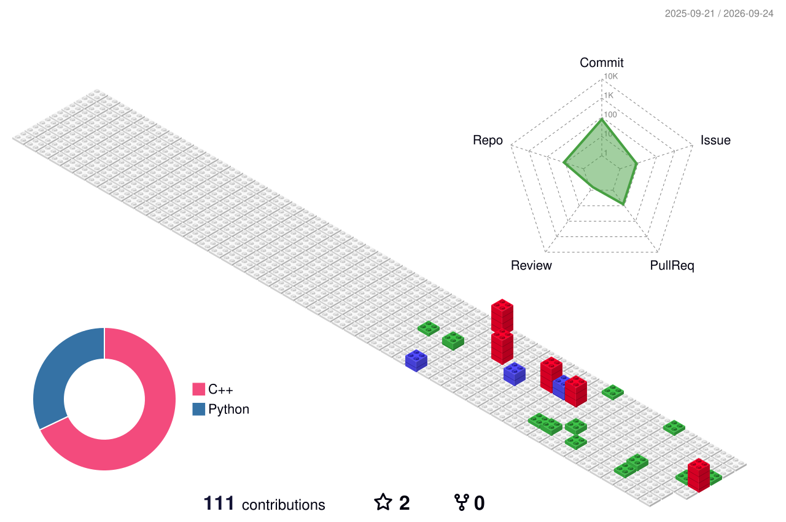

  

<picture>
  <source media="(prefers-color-scheme: dark)" srcset="./profile/github-snake-dark.svg" />
  
</picture>

# 🙋 Hello

<table>
<tr><td>

### 🤺 About Me

👤 **Name:** MengZhe Wu  
🏷️ **GitHub:** ilovecplusplus230  
📝 **Blog:** [CSDN 博客](https://blog.csdn.net/2301_79741830)  
🎓 **Education:** Artificial Intelligence, Harbin Institute of Technology  
🔬 **Interests:** Artificial Intelligence and Large Language Models (LLMs)

</td></tr>
<tr><td>

### 🙌 Contribution

  
  
  
  

</td></tr>
<tr><td>

### 🤾‍♂️ Funny Soul

  
   
  

</td></tr>
</table>

  

### 🧊 3D Contribution Calendar

<picture>
  <source media="(prefers-color-scheme: dark)" srcset="./profile-3d-contrib/profile-night-rainbow.svg" />
  
</picture>

Inspired by <a href="https://github.com/HITLittleZheng/HITLittleZheng">HITLittleZheng</a> and <a href="https://github.com/sun0225SUN/sun0225SUN">sun0225SUN</a>. Cards by <a href="https://github.com/anuraghazra/github-readme-stats">GitHub Readme Stats</a>.

